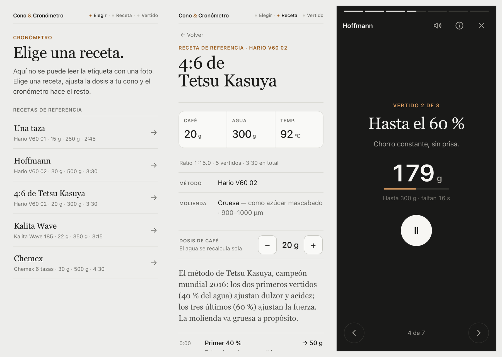

# Cono y Cronómetro

Guía de vertidos para café filtrado. Un paso a la vez, a pantalla completa, y
en vez de una cuenta atrás te dice **el peso que debe marcar la báscula en este
segundo**: mientras viertes el número sube interpolado; en la pausa se queda
quieto. Solo igualas.

Una página, sin dependencias ni build. Abre `index.html` y ya.



## Qué hace

- **Una tarjeta por paso.** Título, qué hacer, el número que importa y el botón.
  Nada más en pantalla mientras tienes el hervidor en la mano.
- **El número se adapta al momento**: mientras viertes es el peso objetivo en
  gramos; en las pausas y el drenado es el tiempo que falta.
- **Barra de progreso por pasos** arriba, y `‹ ›` para adelantar o rehacer uno.
- **La pantalla no se apaga** mientras corre el cronómetro (Screen Wake Lock).
  Si el navegador no lo permite, la app lo dice en vez de fingir.
- **Avisos de audio** en cada cambio de paso y cuenta de 3 antes de arrancar.
- **Ajuste de dosis**: cambias los gramos de café y se recalcula toda el agua.
- **Registro del drenado real**, que es el dato que diagnostica la molienda: si
  se te va más de 30 s por encima de lo previsto, mueles demasiado fino.
- **Cinco recetas de referencia**: una taza (V60), Hoffmann, 4:6 de Tetsu
  Kasuya, Kalita Wave y Chemex, cada una con su porqué y sus correcciones.

## Tipografía

Fuentes del sistema, cero descargas: `ui-serif` para los títulos (New York en
Apple, Georgia en el resto) y `system-ui` para todo lo demás. Además de verse
como debe en iOS, evita el parpadeo de una fuente web en una pantalla que
miras tres minutos seguidos.

## Dos modos

La misma página se adapta a dónde corre:

| | GitHub Pages / local | En un host con lectura de imagen |
|---|---|---|
| Cronómetro y recetas | ✅ | ✅ |
| Leer la etiqueta con una foto | — | ✅ |
| Memoria de bolsas y tazas | — | ✅ |

Lo detecta al cargar: si no hay quien interprete la foto, oculta la cámara y
arranca directo en las recetas de referencia. **No hay claves de API en ninguna
parte y no las habrá**: una página estática no es sitio para una credencial.

## Estructura

```
index.html    todo: estilos, marcado y motor. Fuente de verdad.
```

## Cómo está construido

**El reloj manda.** Una receta es una lista de vertidos con `inicio` (segundo en
que empiezas a verter), `duracion` y `hasta` (peso **acumulado** en la báscula
al terminar ese vertido). De ahí se derivan las esperas y el drenado, y de ahí
sale todo lo demás: qué tarjeta se ve, cuánto lleva llena cada barra de
progreso y qué número va en grande. Nadie escribe esos estados a mano.

```js
cardAt(t)   // qué tarjeta toca en el segundo t
pesoEn(t)   // interpola dentro del vertido, se congela fuera
```

Avanzar de tarjeta no es un evento: es una consecuencia de que el reloj pasó un
límite. Por eso `‹ ›` simplemente mueven el reloj y todo lo demás se acomoda.

### Trampas encontradas

1. El cronómetro deriva el tiempo de `performance.now()`, no de contar frames:
   si el navegador suspende el `requestAnimationFrame` al ocultar la pestaña, al
   volver el reloj sigue correcto.
2. Un hijo de ancho fijo dentro de un contenedor `align-items:center` que a su
   vez está en un bloque con `text-align:center` **no queda centrado**: el
   `text-align` no alcanza a un elemento de bloque. El botón de play y la barra
   se iban a la izquierda hasta convertir la tarjeta en un flex column.
3. `clientHeight` de algo dentro de un panel con `hidden` da **0**, así que
   cualquier medida hay que tomarla después de mostrarlo.

## Licencia

MIT.
